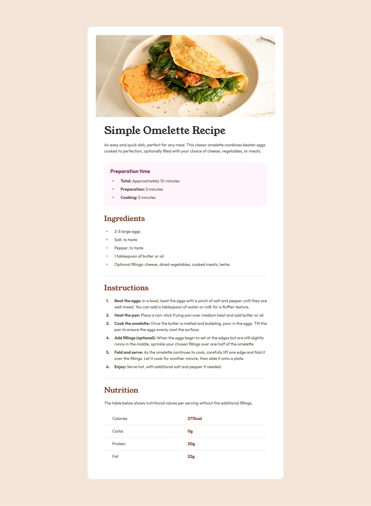

# Frontend Mentor - Recipe page solution

This is a solution to the [Recipe page challenge on Frontend Mentor](https://www.frontendmentor.io/challenges/recipe-page-KiTsR8QQKm). Frontend Mentor challenges help you improve your coding skills by building realistic projects.

## Table of contents

-   [Overview](#overview)
    -   [Screenshot](#screenshot)
    -   [Links](#links)
-   [My process](#my-process)
    -   [Built with](#built-with)
    -   [What I learned](#what-i-learned)
    -   [Useful resources](#useful-resources)

## Overview

### Screenshot



### Links

-   Solution URL: [https://github.com/dpencsi/frontendmentor-recipe-page](https://github.com/dpencsi/frontendmentor-recipe-page)
-   Live Site URL: [https://dpencsi.github.io/frontendmentor-recipe-page/](https://dpencsi.github.io/frontendmentor-recipe-page/)

## My process

### Built with

-   Semantic HTML5 markup
-   CSS custom properties
-   CSS Grid
-   Mobile-first workflow

### What I learned

Using accessibility for example the `role="list"` for the list tags (ul, ol). Creating custom list markers.

The `role="list"`:

```html
<ul role="list" class="flow">
    <li>
        <p><strong>Total:</strong> Approximately 10 minutes</p>
    </li>
    <li>
        <p><strong>Preparation:</strong> 5 minutes</p>
    </li>
    <li>
        <p><strong>Cooking:</strong> 5 minutes</p>
    </li>
</ul>
```

Custom marker:

```css
ul,
ol {
    --_list-indent: var(--list-indent, var(--space-500));
    --_marker-type: var(--marker-type, disc);
    --_marker-suffix: var(--marker-suffix, "");
    --_marker-color: var(--marker-color, var(--brown-800));
    list-style: none;

    li {
        --flow-space: var(--space-100);
        margin-inline-start: var(--_list-indent);
        text-indent: calc(var(--_list-indent) * -1);
    }

    li::before {
        content: counter(list-item, var(--_marker-type)) var(--_marker-suffix);
        color: var(--_marker-color);
        font-weight: 700;
        font-variant-numeric: normal;
        display: block;
        float: left;
        min-width: var(--space-200);
        margin-inline: var(--space-100) var(--space-200);
    }
}

ol {
    --marker-type: decimal;
    --marker-suffix: ".";
}

/* ... other css code */

.preparation_time {
    --_prep-time-color: var(--prep-time-color, var(--rose-800));
    --marker-color: var(--_prep-time-color);

    /* ... */
}
```

### Useful resources

-   [Dave Cross Youtuber](https://www.youtube.com/watch?v=tEsouYJep-w) - This helped how to think about this challenge, the accessibility for list and how to style the list and set a custom marker (extra how to make it dynamic so you can change the marker with css variable).
-   [ARIA: list role](https://developer.mozilla.org/en-US/docs/Web/Accessibility/ARIA/Reference/Roles/list_role) - More about the list role here for accessibility.
-   [Using CSS counters](https://developer.mozilla.org/en-US/docs/Web/CSS/Guides/Counter_styles/Using_counters) - This is a special property in css what we used for the list `li` to add custom marker to it.